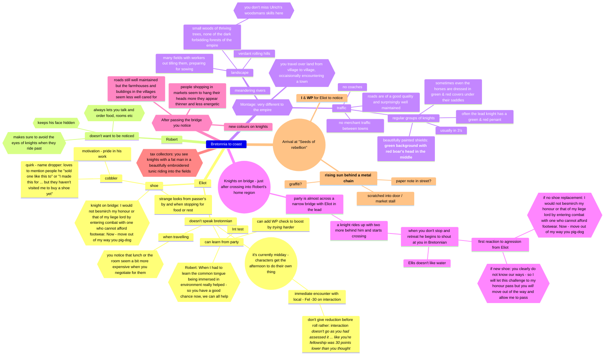

# WIP Ideas

[[TOC]]

That's great - thanks.
I think I will montage the majority of the travel and throw in a few individual scenes for flavour. I would like to paint the first part of Bretonnia in a reasonably good light to add contrast to the region where Robert comes from.

## Journey outline - Part 1

1. we spend the afternoon in border village before leaving in the morning
    - expect Eliot to go out either to look for Verenan temple or buy a shoe
    - maybe Raya will go to Shallyan temple, maybe she will choose to spend time with Ellis
    - introduce Ellis to Eliot and introduce Truthseekers ability to boost perception when she hands it to him (he notices something about her appearance - use a I followed by WP boosting roll to show new game mechanic)
1. Montage through current region a few individual NPC encounters / mini-scenes if the players react to any of the elements
1. Encounter on bridge after crossing into Robert's region (see [[Knights on bridge - just after crossing into Robert's home region]] below)
1. Get to the town where [["Seeds of rebellion"]] will take place
1. They will meet the Wayward Knight at some point ... maybe today, maybe in the next game session - we'll improv that when it makes sense and I'll ask for more details later.

## Ideas




## Background details

I have a few questions and would like to go through them in groups. First - the background details:

- name of lord of first region: emblem - red boars head on field of green
- name of robert's brother (second region) ??? de-Caucy
- emblem for Robert's brother (region is northern, coastline, landscape mixture: seine-maritime, Hautes-de-France, ardenne, marne, meuse)

Below are some background detail suggestions that you can adapt and expand as needed for your Bretonnian travel adventure:

---

### 1. Lord of the First Region

**Name:** **Lord Baudouin de Sanglier**  
**Emblem:** A brilliant red boar's head set against a lush field of green.  

**Background Notes:**  

- Lord Baudouin is a principled man whose heraldry boldly proclaims his domain’s identity.  
- His emblem—the red boar's head—symbolizes both ferocity in battle and an untamed, almost pastoral vigor that inspires his people.  
- With this striking emblem, the first region is immediately marked as one of relative prosperity and pride, a welcome contrast to the harsher areas further north.

---

### 2. Robert’s Brother – The Northerner

**Name:** **Guy de Caucy**  
(Using “de Caucy” both as his family name and regional signifier hints at centuries of tradition.)  

**Emblem:**  

- **Shield Base:** A silver field, representing the wintry resilience and cool dignity of the northern coasts.  
- **Primary Charge:** Across the base runs a deep blue wavy band that symbolizes the sea and coastal trade routes.  
- **Central Motif:** A golden anchor centered on the shield—this heraldic element speaks of maritime strength and steadfastness.  
- **Additional Detail (Optional):** Flanking the anchor, a pair of crossed sabres (or short broadswords) may be added to denote martial prowess and the region’s readiness to defend its legacy.

**Background Notes:**  

- Guy de Caucy’s domain is a fascinating blend: part rugged coastal region with strong maritime traditions and part fertile heartland reminiscent of areas like Seine-Maritime and Hauts-de-France.  
- The emblem’s balance between the soft silver and cool blue, accented by the striking gold of the anchor, reflects a region where the abundance of the land meets the challenge and inspiration of the sea.  
- While his brother (Robert) is emerging as a force for the people, Guy de Caucy maintains a more traditional—and perhaps more secretive—stance, making the contrast both a narrative and visual one.

---

### A Quick Visual Comparison

Below is an ASCII sketch conceptualizing the two emblems side-by-side:

```txt
First Region (Lord Baudouin de Sanglier)
 ____________________________________
|                                    |
|        [RED BOAR HEAD]             |
|                                    |
|       on GREEN field               |
|____________________________________|

Second Region (Guy de Caucy)
 ____________________________________
|                                    |
|     SILVER background              |
|        ─────────── (blue wave)     |
|          [Golden Anchor]           |
|     [Crossed sabres optional]      |
|____________________________________|
```

---

### Additional Thoughts

- **Contrast in Atmosphere:**  
  By painting the first region in such a vibrant and noble light—where even interactions (like Eliot’s language mishaps or a quirky cobbler’s reputation) have a gentle humor—you set up a striking contrast to the more austere, regimented, and burdened environment of Robert’s ancestral lands later on.

- **Foreshadowing Character Dynamics:**  
  While Lord Baudouin might represent a fleeting ideal for Bretonnian nobility, Guy de Caucy’s emblem and subtly darker regional vibe could hint at older, more rigid traditions and even secret intrigues that might later offer challenging moral or political conflicts for Robert.

If you’d like to expand on these ideas—whether by deepening the history of these noble families, elaborating on regional customs, or even exploring potential rivalries between them—I’d be happy to brainstorm further.

## Cobbler

I like to ensure characters are memorable and fun by ensuring they have a good name, a clear motivation/current goal and some a memorable feature or quirk (this could be a simple as an item of clothing/jewelery/haircut/beard/nasal hair, or could be a way of speech, mannerism, health condition, etc.)

- I need a name for the cobbler and description of his stall in a bustling marketplace (see mindmap for his motivation and quirk)

Here's a suggestion that brings your cobbler to life:

---

### Name and Personality

**Name:** Marcel Le Soulier

**Motivation:**  
Marcel prides himself on his craft above all else. Every shoe carries a bit of his soul, and he dreams of one day having his work recognized by the highest circles of Bretonnian nobility. He’s motivated by the belief that quality craftsmanship can elevate even the humblest of folk.

**Quirk:**  
A compulsive name dropper, Marcel can’t help but recount storied sales. In every conversation, he’ll keenly mention, “I made one just like these for Sir Bertrand at last year’s festival!” or “Madame Aurelie herself requested a pair—only a few days past!” His gregarious manner and eloquent sales pitches ensure that no customer's purchase goes uncelebrated.

---

### The Stall at the Marketplace

Marcel’s stall, known as **"Les Souliers de Marcel"**, is a modest yet eye-catching fixture in the bustling marketplace. Here’s how you might bring it to vibrant life:

- **Facade and Signage:**  
  A well-painted wooden sign hangs above his awning, crafted in flowing, ornate script that reads “Les Souliers de Marcel.” The faded yet lovingly preserved emblem—a small, subtly embroidered boot—is displayed next to the name, hinting at the pride he takes in his trade.

- **Layout & Décor:**  
  His stall is a small wooden booth between a bright fruit vendor and a stall draped with silks. Marcel has arranged his wares with meticulous care: rows of carefully polished shoes and boots hang on sturdy hooks, interspersed with neatly stacked boxes lined with soft linen.  
  A small chalkboard at the front of his stall details "special orders" and recent noteworthy commissions, a running roster of names that he can recite with considerable flair.

- **Workstation:**  
  Behind the counter stands his worktable—a well-worn wooden bench cluttered with an assortment of leather pieces, precisely sharpened leather punches, various needles, carnelian-dyed threads, and little jars of rich, scented leather polish. Tools are arranged in order of use and preference, embodying both practicality and passion.

- **Atmosphere and Interaction:**  
  As customers approach, Marcel greets them with an affable smile and an eager glint in his eye. Waving a hand over his finely crafted displays, he launches into animated monologues about his past illustrious sales:
  > *"Ah, see these fine boots? I made a pair just like these for Sir Bertrand on a fair spring morning—if only you've had the good fortune to try them on! And then there was Madame Aurelie, quite the connoisseur of comfort, who wouldn't settle for less than perfection!"*
  
  His enthusiastic banter not only highlights his impeccable craftsmanship but also leaves a memorable impression, making his stall a must-visit stop in the market for both locals and travelers.

---

This character and setting should add a burst of colorful charm to your journey, bringing a slice of everyday Bretonnian life into an epic adventure. If you’d like more interactive details or additional characters to mingle with Marcel’s stall, feel free to ask—I’ve got plenty more ideas to share!

## Villager in the border village where they are right now

- I also need a little something to make the random person who Eliot meets in the current village come to life

Meet **Gaston Rieu**, a gruff, no-nonsense local whose curt manner serves as an impromptu lesson in Bretonnian etiquette and language for visiting travelers.

---

### Appearance & Demeanor

- **Weathered Features:**  
  Gaston is a weather-beaten middle-aged man with deep-set eyes, lined with years of hard work and a suspicion of outsiders. His unkempt, graying hair and a perpetually furrowed brow announce his discontent with idle chatter.

- **Rugged Attire:**  
  He wears a battered, dark woolen cap and a threadbare leather vest over a coarse linen shirt. Every fold and crease of his simple garb speaks of a life spent in the elements, not in courtly finery.

- **Gruff Voice:**  
  His tone is clipped and direct, punctuated by a rough accent that reveals his deep-rooted connection to the land. When he speaks—albeit reluctantly—his words carry the weight of a lifetime of experience.

---

### Personality & Role

- **Short Temper, Simple Goals:**  
  Gaston’s primary concerns are the daily toils of village life—tending his modest field, caring for his few livestock, and ensuring that the local customs are respected. His grumpiness often clouds any warm welcome, and he has little patience for anyone who doesn't make the effort to respect Bretonnian ways.

- **Language Lesson:**  
  One of Gaston’s frequent gripes is the proliferation of foreigners who speak in a muddled mix of their own language and broken Bretonnian. His curt rebukes—“Parle comme on le fait ici!” ("Speak as we do here!")—remind travelers that proper communication is not only a courtesy but also a key to survival in these parts.  
  For instance, if Eliot or any visitor stumbles over local idioms, Gaston won’t hesitate to point it out with a disappointed snort, offering a slice of local wisdom (sometimes accompanied by an unsolicited lesson on the correct pronunciation of church names or market slang).

- **Memorable Interaction:**  
  When Eliot haggles over a minor purchase or asks a local for directions, Gaston might grumble:  
  > “If you can’t muster a proper greeting in our tongue, don’t expect a kind answer from me. Out here, words are like the fields—cultivated with care, or they go to seed.”  
  This serves as both a wake-up call and a humorous, if gruff, charm that makes Gaston memorable.

---

### Role in the Story

Gaston Rieu embodies the everyday challenges of assimilation into Bretonnian culture. His rough exterior and blunt corrections of local language help illustrate to the characters—especially those like Eliot—the importance of understanding and integrating into the local way of life as they traverse Bretonnia. His grumble may be simple, but it echoes the sentiment that language connects people in a realm where every word can carry the weight of tradition and expectation.

With Gaston, a brief but pointed encounter turns into a lesson in respect and survival in a world where local customs are as vital as any weapon or skill. This small interaction can serve both as comic relief and as an educational moment for your players.

If you need additional quirks, other interactions, or ideas for how Gaston might reappear later in the story, let me know—I’ve plenty more ideas to help deepen your world!

## Shallya

- how to add some feel for the extra value which Bretonnia places on Shallya (in B she is the most important of the Gods - behind the Bretonnian Lady of the Lake, compared to the Empire where she is equal to many deities)

Below are several techniques and narrative details you can use to weave Shallya’s exalted status into your Bretonnian setting, making her presence feel both ubiquitous and deeply cherished:

---

### 1. **Sacred Details and Atmosphere**

- **Temple Scenes:**  
  When the party visits a Shallyan temple or shrine—even a small roadside chapel—the environment should radiate gentle, restorative light. Describe walls adorned with vibrant stained glass depicting Shallya’s healing miracles, mosaics of flowing water and gentle hands, and a soft chorus of hushed prayers. Even the dullest corridor might shine with the golden glow of votive candles and incense, underlining that in Bretonnia, every ray of light seems to be a benediction from Shallya herself.

- **Everyday Altars:**  
  In Bretonnia, devotion to Shallya isn’t confined to grand cathedrals. Local households might have small, humble altars—a simple wooden cross or a painted figure of Shallya—displayed near doorways. Market stalls, taverns, and even farmhouses might bear a carved charm or embroidered sigil invoking her protection. These subtle touches visually and emotionally remind everyone that her mercy and warmth is a constant, everyday blessing.

---

### 2. **Rituals, Proverbs, and Public Acts**

- **Dawn Ceremonies:**  
  Describe early morning scenes where locals gather in a village square or near a temple to offer quiet thanks to Shallya. They might rinse their faces at a communal fountain or say a short, melodious prayer that invokes her healing grace. The ritual, simple yet sincere, can set a tone that contrasts with the harsher, more diverse worship seen in the Empire.

- **Local Proverbs & Expressions:**  
  Infuse dialogue with cultural idioms that highlight her singular importance in Bretonnia. For example, characters might say:  
  > “May Shallya’s gentle hand mend your wounds as surely as it soothes the meadows at dawn.”  
  These sayings can serve both as a blessing and as a cultural nudge to remind everyone that Bretonnia’s soul is intertwined with Shallya’s compassion.

- **Festivals of Mercy:**  
  Organize a small local celebration—a harvest festival or a healing day—where the community pays homage to Shallya with songs, dances, and gentle contests of kindness. Here, characters can observe (or even participate in) public acts of charity, reinforcing that her domain is not just about curing wounds but also about nurturing the spirit and community.

---

### 3. **Contrasting the Empire**

- **Relative Exclusivity:**  
  In the Empire, the pantheon is crowded, and no single deity holds sway over every aspect of daily life. By contrast, in Bretonnia, Shallya’s image and influence permeate all aspects of society. When characters travel through Bretonnian lands, they might note how statues of other deities are rare—a tacit cultural choice made in favor of Shallya and the reverence of tradition.  
  For example, a local priestess might explain,  
  > “Here in Bretonnia, Shallya’s healing grace is our common thread. We look to her not just in prayer but in every act of mutual care.”

- **Art and Iconography:**  
  The art and architecture in Bretonnia should reflect a singular, passionate ideal of mercy and healing. Murals in town halls, wooden carvings on market stalls, and even heraldic devices could incorporate Shallyan motifs—a gentle hand pressed over a rising sun, or a soft cascade of water turning into blossoms. These images constantly remind visitors of a unified faith that shields community life.

---

### 4. **Interactive Moments for Characters**

- **Personal Encounters:**  
  Let a subtle scene reveal her importance: perhaps Raya, drawn to a Shallyan temple, finds herself engaged by an elderly devotee—one who explains how even the air here seems to carry Shallya’s blessing. This encounter could be filled with heartfelt anecdotes: the devotee recalls miracles of healing done in the valley or the sincere relief felt after a hard harvest season. These personal touches add body to the idea that in Bretonnia, faith in Shallya isn’t abstract but lived and experienced.

- **Cultural Lessons:**  
  With characters like Eliot struggling with the local tongue or manners, a patient local might mention that sometimes a kind word to Shallya, even if clumsily spoken, earns you a gentle smile from your neighbors. It reinforces that language and manners here are steeped in a dual heritage of piety and care—thus teaching newcomers that embracing local customs means embracing the benevolence of Shallya.

---

### Visual Summary

To capture this layered cultural reverence in a simple diagram:

```txt
         [ Bretonnian Culture ]
                   │
         ┌─────────┴─────────┐
         │                   │
 [ Daily Devotion ]   [ Public Rituals ]
         │                   │
 - Household altars   - Dawn ceremonies
 - Local charms       - Festivals of mercy
 - Everyday blessings - Community prayers
         │                   │
         └════════  Shallya  ════════┘
                   │
  [ Singular Faith & Healing ]
```

This diagram emphasizes that every facet of Bretonnian society—be it a modest home or a grand temple—echoes the gentle, unparalleled presence of Shallya.

---

By interweaving vivid sights, sounds, and everyday acts of devotion with the underlying regional pride in Shallya, you not only showcase her spiritual importance but also enrich your players’ experience of Bretonnia as a land where compassion, healing, and mercy are woven into the very fabric of life.

If you’d like further ideas—perhaps on how a personal quest might involve Shallya’s teachings or a unique miracle that sets a turning point in your story—I’d be happy to delve deeper into those avenues!

## Comparison to the Empire

- any other comparisons I can make to the Empire (people, inns, buildings, fashion, ...) which will add flavour to Bretonnia overall

Here are some detailed contrasts you can weave into your sessions to highlight Bretonnia’s unique charm compared to the Empire. Each area—from the people to the very architecture—can be crafted to evoke a distinct, elevated atmosphere in Bretonnia:

---

## People

- **Bretonnian Nobility & Peasantry:**  
  In Bretonnia, there’s an almost mythic ideal of chivalry and courtly manners. Even the common folk tend to speak with a touch of decorum, often peppering their speech with ancient proverbs and poetic blessings invoking Shallya or the Lady of the Lake. In contrast, the Empire’s citizenry is more practical and rough-hewn—survival often trumps elegance.  
- **Community Spirit:**  
  Bretonnian villagers share a strong sense of regional pride and tradition. Their conversations can revolve around gallant feats, ancient legends, or tales of miraculous healing—elements that testify to a culture steeped in myth. Meanwhile, Empire folk might focus on everyday pragmatism and the chaotic hustle of city life, where many deities share the spotlight and none receives a singular, warm devotion.

---

## Inns and Taverns

- **Atmosphere & Décor:**  
  Bretonnian inns are designed to be refuges of grace: wooden beams adorned with delicate carvings, stained-glass windows catching the early morning light, and altars or small shrines to Shallya in quiet corners. The ambiance smells of freshly baked bread and herb-infused stews, inviting travelers to relax in an almost sanctified environment.  
- **Contrast to the Empire:**  
  In the Empire, inns are turbulent meeting grounds—crowded, sometimes dingy, where a hodgepodge of travelers exchange brash banter. Bretonnian establishments, by contrast, echo with soft voices, measured laughter, and respectful nods to tradition. It’s a place where hospitality isn’t just a service—it’s a quasi-religious duty rooted in communal care.

---

## Buildings and Architecture

- **Elegant Simplicity:**  
  Bretonnian architecture tends to favor rustic elegance. Imagine half-timbered houses with gracefully arched doorways, well-maintained village squares centered on ancient oaks, and modest chapels where every stone seems lovingly placed. These structures, passed down through generations, evoke a sense of continuity and deep-rooted history.  
- **Empire’s Baroque Complexity:**  
  By contrast, buildings in the Empire can be far grander yet more ostentatious—massive cathedrals, crowded guild halls, and sprawling marketplaces built to impress and intimidate. They often possess a more utilitarian, layered look where practicality and diverse religious influences mix in a more frenetic urban sprawl.

---

## Fashion and Style

- **Courtly and Pastoral Aesthetics:**  
  Bretonnian dress captures the romanticism of chivalry. Lords, knights, and even the well-to-do commoners dress in garments that subtly hint at heraldic symbolism—the red and green of noble insignia, delicate embroidery reminiscent of heraldic legends, and tunics that seem to gleam in the soft countryside light.  
- **The Empire’s Varied, Earthy Fashions:**  
  In the Empire, fashion is often more eclectic and variable—reflecting the multi-deity, multi-regional tapestry of its society. While some might wear elegant finery, many dress for practicality, mixing worn leather with utilitarian cloth. Bretonnian attire, by contrast, sings a more unified hymn of tradition and refined social order—even among the peasantry.

---

## Culture and Daily Life

- **Religious Centrality:**  
  Bretonnia cherishes a deep, unified faith in Shallya, whose imagery and influence permeate even the mundane—a baker might sprinkle a few blessings over his loaves, and market stalls could bear small Shallyan sigils as tokens of protection. In the Empire the gods, though respected, exist in a busy pantheon where no single deity consistently guides everyday life.
- **Art and Storytelling:**  
  In Bretonnia, even the simplest gestures—a brush stroke on a tavern wall, a carved symbol on a doorpost—can be imbued with meaning and history. Songs of heroic deeds, nostalgic laments for lost beauty, and gentle blessings are common. Conversely, Empire culture is often more frenzied, with art and literature reflecting the struggles of war, bureaucratic chaos, and an assortment of patron deities battling for dominant recognition.

---

## Bringing It Together in Play

When your players travel from the cozy, almost idyllic border village into Robert’s region, you can use these contrasts to deepen immersion:

- A traveler might remark on how the local inn’s quiet, temple-like ambiance soothes the soul, a stark shift from the rowdy, cramped taverns of the Empire many have known.  
- A well-dressed Bretonnian peasant might speak proudly of his heritage using refined, almost lyrical phrases, which contrasts with the blunt, everyday speech of a city-dweller from the Empire.  
- Even the architecture can be a storyteller—a village church’s stained glass intact and bathed in morning light versus the Empire’s jagged, worn-down structures that hint at a harsher urban existence.

By spotlighting these elements, you not only enrich your world but also invite the characters (and your players) to appreciate the nuances between seemingly similar regions. If you’d like more comparative details or additional angles (perhaps exploring cuisine, local festivals, or even transportation differences), feel free to ask—I’m ready to help you make Bretonnia as vivid and enchanting as you envision.

## Preparing for the "seeds of rebellion"

- how to introduce the scene / village where the encounter "Seeds of rebellion" will take place

Here's a multi-layered approach to introducing the village where "Seeds of Rebellion" will unfold, blending atmospheric description and subtle clues to the underlying dissent:

---

### 1. **Setting the Stage**

**Arriving on the Road:**  
As the party nears the village, begin by describing the transition from rolling, well-tended fields into a more modest and weathered settlement. The scenery shifts from the orderly, sunlit expanses of Bretonnia into a patchwork of faded homesteads, quiet lanes, and a hum of murmur that speaks of long-held suffering.

- **Visual Cues:**  
  - Houses are constructed of aging timber with stone foundations.  
  - Faded pennants or simple banners flapping in the breeze hint at loyalty to a local lord—its iconography subtly tarnished by wear and neglect.  
  - Farmland appears less vibrant; plowed fields show signs of overuse and fatigue.

**Atmospheric Tones:**  
Layer your descriptions with imagery that reveals both the beauty of Bretonnia and the cost of oppression. For instance:  

- "The sun sets on the horizon, its golden light reflecting off the humble rooftops, but in the shadows, weary faces collide with whispered grievances."  
- "A chill breeze carries more than just the promise of night—it carries murmurs of discontent, barely masked by polite conversation at the market stalls."

---

### 2. **Introducing the Heart of the Village**

**The Village Square:**  
The central square acts as a microcosm of the villagers' daily life—apparent normalcy overlaying deep-seated tensions. Describe the square as a gathering place where:

- A modest stone well stands as the centerpiece. Around it, villagers exchange cautious greetings, their eyes a little too wary, as if each word is measured.
- Notice boards and scraps of parchment pinned to a post are visible. Some pieces of paper, hastily scrawled in the local tongue, allude to secret meetings or grievances against unjust taxes and local abuses.

**Local Establishments:**  

- **The Village Inn:**  
  A small but sturdy building serves as a gathering spot. Its sign, hand-painted and worn, depicts a simple emblem—a broken plough or a weathered shield. Inside, the atmosphere is subdued: hushed tones, furtive glances, and half-spoken rumors of the lord’s oppressive measures. These details contrast sharply with the more cheerful and reverential taverns found in the flourishing parts of Bretonnia.
  
- **Marketplace:**  
  In a ramshackle market alley, vendors sell everyday wares, but listen closely to their personal exchanges. Beneath their routine haggling lie complaints and conspiratorial whispers—a shared sense that the current order is unsustainable.

---

### 3. **Clues of Dissent**

**Subtle Markers of Rebellion:**  

- **Graffiti and Hidden Symbols:**  
  In a discreet corner of the square or on a neglected wall of a building, you might notice a symbol—a crude drawing of a rising sun behind a broken chain, or perhaps a simple mark that the perceptive could later interpret as a rallying sign for the oppressed.  
- **Murmurs Among Locals:**  
  When engaging with the locals (or even overhearing idle tavern chatter), let them mention in hushed voices the name of a forgotten village elder who once stood up to the lord’s excesses, or recount tales of secret gatherings held late at night under the cover of darkness.

**A Noticeable Change:**  
Point out how, after passing a particular landmark (perhaps an old boundary stone or a vanished sign), the feel of the land shifts—the air grows heavier, the villagers wear their hardships visibly, and the radiant idealism of Bretonnia softens as if gripped by a shared sorrow. The contrast acts as a natural lead-in to the "Seeds of Rebellion" encounter.

---

### 4. **Interactive Entry**

**Opening Scene Hook for the Party:**  
As your players step foot into the village:

- **Narrative Hook:**  
  "Before you stands a modest village where hope feels both fragile and fierce—a place where the smiles of the children are tinted with caution, and every whispered word behind closed doors could be a spark waiting to ignite. You notice a faded notice pinned to the town’s notice board, squinting in the weak light: 'For justice and fair tilling of our fields—gather tonight by the old oak.' Such subtle hints of rebellion stir a mixture of unease and hidden excitement in the air."
  
- **NPC Interaction:**  
  Introduce a key, perhaps unnamed, minor local: a farmer with gravel in his voice who, in a brief conversation with one of the party members, confesses murmurs of unfair taxation and a longing for a fairer future. He doesn’t offer a full story—only cryptic hints—inviting the adventurers to dig deeper.

---

### 5. **Reinforcing the Rebellion Narrative**

- **Contrast with Prior Regions:**  
  Remind the players that they've just left the relative brightness and hope of earlier Bretonnia. This village, though part of the broader cultural and natural beauty of the land, bears scars of an oppressive hierarchy.  
- **Emotional Underpinning:**  
  Emphasize the internal conflict—there’s beauty here, but also a somber reminder of what happens when power goes unchecked.  
- **Sensory Details to Build Mood:**  
  Use sensory descriptions: the somber murmur of a soft rain falling over parched fields, the bitter tang of unfulfilled promise in the air, and the gentle, persistent rustling of leaves as if carrying secrets of the past and omens of future change.

---

### Visual Flowchart of the Scene

Below is an ASCII diagram offering a simple visual aid for organizing these ideas:

```txt
                      [Approach to the Village]
                                │
        ┌───────────────────────┴────────────────────────┐
        │                                                │
[Visual Transition]                              [Atmospheric Tone]
        │                                                │
Fading fields, weathered homes               Murmurs of discontent, hushed tones
        │                                                │
        └─────────────┬───────────────┬────────────────────┘
                      │               │
         [Village Core: Square & Inn]  [Hidden Clues]
                      │               │
         - Stone well with notice       - Secret graffiti symbols
         - Faded banners                - Cautious market gossip
         - Worn notice board            - Whispers of secret gatherings
                      │
         [Interactive Hook for PCs]
                      │
       "Gather tonight by the old oak..."
```

---

By layering these descriptions and interactions, your village feels more than just a waypoint—it becomes a living, breathing emblem of both the oppression and the burgeoning desire for change. The scene sets up the "Seeds of Rebellion" adventure not as an isolated encounter, but as an organic emergence of hope in a place otherwise weighed down by hardship.

Feel free to adapt any detail to match your narrative style or the particular tastes of your players. Do you need further assistance with integrating NPCs or subsequent scenes related to the rebellion?

## Wayward knight

- Finally I'd really like to have the wayward knight ready as a person ... let's flesh him out too with a the following options:
  - as a guide to Bretonnian culture
  - as a guide to help with the "Seeds of Rebellion"
  - as a guide to the happenings in Robert's home region

Below are three different takes on the wayward knight, each designed to serve a distinct narrative role. You can use one variant—or even blend elements—to create an NPC whose multifaceted nature lets him guide the party in various ways throughout Bretonnia.

---

## Option 1: The Cultural Mentor

**Name:** Sir Tristan d’Aveline

**Background:**  
Once raised in a noble household renowned for its patronage of the arts and chivalry, Sir Tristan devoted himself to understanding the very soul of Bretonnian culture. Disenchanted with the political intrigues of court, he left his service and wandered across the realm, becoming both a keeper of ancient traditions and an informal tutor in Bretonnian ways.

**Personality & Quirks:**  

- **Gentle Demeanor:** Calm and measured, Sir Tristan speaks in a lyrical, well-enunciated manner that reflects centuries-old chivalric codes.  
- **Detail-Oriented:** He notices small cultural details—a subtle reference in local song, the brush of a priestess’s habit—and delights in explaining their deeper meaning.  
- **Memorable Quirk:** He habitually quotes Bretonnian proverbs and ancient legends. Expect him to say things like,  
  > “In every gentle brook, Shallya’s mercy flows. Such is the heart of our land.”

**Role as a Guide:**  

- **Bretonnian Culture 101:** His knowledge spans local festivals, temple rituals honoring Shallya, chivalric honor, and even the symbolism hidden in everyday life.  
- **Practical Lessons:** Whether showing the party how to greet a local properly or explaining the significance of a well-worn crest on a farmhouse door, his gentle lectures help players both role-play authentically and appreciate the region’s soul.

---

## Option 2: The Rebel Heart

**Name:** Sir Lucien Valcourt

**Background:**  
Born into a noble family, Sir Lucien witnessed firsthand the cruelty and injustice inflicted upon common folk by those in power. Disgusted by his superiors’ indifference, he renounced his rank and now covertly aids the oppressed. Rumors whisper that he once donned the red and green of noble houses but now wears armor patched with hints of rebellion—a broken chain embroidered in his cloak, for example.

**Personality & Quirks:**  

- **Determined & Incisive:** Lucien speaks in short, brisk sentences that cut straight to the truth. His tone often carries a hard edge, a mix of regret and steely resolve.  
- **Uncompromising Honesty:** He never shies away from calling out injustice, even if it means ruffling feathers among those loyal to corrupt authority.  
- **Memorable Quirk:** He has a habit of tapping his gauntleted fingers on his scabbard when emphasizing a point—a silent reminder that, for him, honor is forged in action rather than words.

**Role as a Guide:**  

- **For the "Seeds of Rebellion":** Sir Lucien is uniquely placed to offer insights into the undercurrents of discontent. He can discreetly share secret meeting points, discuss local oppression, and advise on how best to support the villagers’ burdened hopes for change.  
- **Inspiration in Action:** His personal story—one of sacrifice and defiance—serves as a rallying cry for those yearning for justice in a system dominated by aristocratic cruelty.

---

## Option 3: The Regional Insider

**Name:** Sir Hector Lemaire

**Background:**  
A veteran of several uneasy campaigns in Robert’s home region, Sir Hector is a living repository of local intrigues and power struggles. Formerly an officer serving the more traditionalist factions, disillusionment with rampant corruption and secret machinations led him to leave that life behind. Now he wanders the northern fields, silently chronicling the ebb and flow of power.

**Personality & Quirks:**  

- **Measured & Wise:** Sir Hector’s conversation is slow, deliberate—a blend of military precision and personal regret as he recounts the darker side of nobility.  
- **Insightful Analyst:** He often provides detailed historical and social context to current events, connecting seemingly disparate local incidents into a coherent—and sometimes troubling—narrative.  
- **Memorable Quirk:** Frequently, he fiddles with a tarnished medallion or adjusts his travel-worn cloak, as though unconsciously marking time from battles past and the heavy weight of his memories.

**Role as a Guide:**  

- **On Happenings in Robert’s Home Region:** Sir Hector can serve as the party’s "local news" source, detailing the intricate politics of the northern coast. He can explain why certain nobles behave the way they do, reveal hidden rivalries, and caution the party about emergent threats lurking beneath refined appearances.  
- **A Repository of Secrets:** With both streetwise smarts and battle-hardened knowledge, he can give hints about future allies—and foes—as the party delves deeper into the complexities of Robert’s ancestral lands.

---

## Visual Summary

Here’s a quick table to help visualize the differences:

| Role/Aspect                  | Cultural Mentor (Tristan)                  | Rebel Heart (Lucien)                | Regional Insider (Hector)           |
|------------------------------|--------------------------------------------|-------------------------------------|-------------------------------------|
| **Name**                     | Sir Tristan d’Aveline                      | Sir Lucien Valcourt                 | Sir Hector Lemaire                  |
| **Background**               | Noble turned keeper of tradition         | Noble renouncing rank for justice   | Former officer disillusioned by power struggles |
| **Personality**              | Gentle, lyrical, detail-oriented         | Direct, uncompromising, passionate  | Measured, analytical, reflective    |
| **Memorable Quirk**          | Recites ancient proverbs                   | Taps gauntleted fingers on scabbard | Fiddles with a tarnished medallion  |
| **Primary Role**             | Guide to Bretonnian culture                | Guide for seeds of rebellion        | Informant on Robert’s home region   |

---

Each version of the wayward knight brings a unique flavor to the narrative. Whether the party needs insights on cultural traditions, a rallying coach for a budding rebellion, or accurate intel on the political workings of Robert’s home region, one of these figures can seamlessly slip into your story. Feel free to blend characteristics from each variant to design a truly memorable character who evolves with the campaign!

## More thoughts

- Dwarf vs Fey

### Villager: Pierre Lemoine

Here's a suggestion for a memorable villager Eliot might bump into in the border village:

---

**Appearance & Quirk:**  
Pierre is a middle-aged man with a weathered face that reflects years of tending to his small plot of land. He’s never without his dented straw hat, which he tips with an exaggerated flourish when greeting passers-by. One of his most distinctive features is a missing front tooth—always on display when he grins—which he claims gives him “an extra dose of village wisdom.” Clutched in his calloused hand is a tiny, hand-carved talisman (a miniature boar’s head), said to ward off misfortune, which he checks for luck at every bend.

**Personality & Motivation:**  
Pierre is a storyteller at heart and takes immense pride in preserving the traditions and local lore of his village. He’s deeply rooted in the old ways, yet his eyes shine with quiet curiosity about changes coming from beyond the borders. His goal is to ensure that the tales of the past—the legends of forgotten temples, heroic feats, and the quiet resilience of village folk—are passed on to every traveler. He loves sharing cryptic hints of local mysteries, especially those connected to the elusive Verenan temple, inviting interested visitors to listen a little closer and look a little deeper.

**Interaction Flavor:**  
When Eliot wanders into the village square—perhaps seeking a clue about the Verenan temple or simply buying time until the next adventure—Pierre is there. With a friendly, conspiratorial smile, he might remark:
> “Ah, stranger, I see you’ve arrived at a turning point of old magic and new tales. They say the winds whisper secrets near the Verenan ruins, and my old charm here never fails to remind me—sometimes it’s not just the journey that changes a man, but the stories he collects along the way.”

This lively greeting invites Eliot (and the whole party) to share a moment of local color. Pierre’s mix of genial humor, a dash of superstition, and veiled hints of hidden lore make him a small but memorable piece of the vibrant tapestry that is life in the border village.

---

This character offers a brief yet vivid interaction for Eliot—one that enhances the flavor of the village and sparks curiosity about the local legends. Feel free to tweak any details to better match your running narrative or to add more local specifics as your players wander further into Bretonnian life!

## Stats

Below are a couple of ready-to-use stat blocks for key NPCs that might spark dice-rolling during your travel to the village in Caucy. You can adjust numbers to keep things balanced for family play. These blocks follow a simplified version of WFRP1e’s attributes (WS, BS, S, T, Ag, Int, WP, Fel) and include a few narrative notes to help guide role-play.

---

### 1. The Bridge Knight  

*This knight emerges as the party is crossing a narrow bridge—a test of Bretonnian etiquette and honor. His demeanor changes depending on whether a character (e.g., Eliot) sports a new shoe or not.*

**Name:** Sir Kervin Boucheron

| Attribute        | Value | Description/Notes                                     |
|------------------|-------|-------------------------------------------------------|
| **WS (Weapon Skill)**       | 40    | A seasoned fighter with honed combat skills.      |
| **BS (Ballistic Skill)**    | 35    | Competent with ranged or thrown weapons if needed. |
| **Strength (S)**            | 35    | Slightly above average, enough to handle heavy arms. |
| **Toughness (T)**           | 45    | Muscular and durable from many campaigns.         |
| **Agility (Ag)**            | 35    | Adept at maneuvering, both on-foot and on-horse.    |
| **Intelligence (Int)**      | 30    | Practical, if not scholarly.                        |
| **Willpower (WP)**          | 40    | Steadfast in his adherence to honor and duty.       |
| **Fellowship (Fel)**        | 30    | Gruff and elitist—shows little warmth to commoners. |

**Skills & Special Abilities:**

- **Riding:** Handles his steed with ease.
- **Intimidation:** Uses his commanding presence to enforce local customs.
- **Honor Check:** When challenged (especially if a party member’s appearance raises questions of respect—like missing or new shoes), call for an Honorable Roll.  
  - *If Eliot is without proper footwear:** He declares sharply, “I would not besmirch my honor or that of my liege lord by sharing a path with one so ill-equipped. Step aside!”  
  - *If corrected by a new shoe:** He concedes with a rigid nod, “You clearly have tried to mend your honor—move along, but remember, true nobility begins with respect.”

---

### 2. The Rebel Villager (Potential Seeds of Rebellion Contact)  

*A local dissident whose quiet defiance hints at the brewing desire for change. He might be the one to plant the first seeds of rebellion or simply share rumors of injustice.*

**Name:** Emmanuel “Le Brave” DelaRue

| Attribute        | Value | Description/Notes                                    |
|------------------|-------|------------------------------------------------------|
| **WS (Weapon Skill)**       | 30    | No professional training; relies on raw determination.        |
| **BS (Ballistic Skill)**    | 25    | Not adept with ranged weapons.                   |
| **Strength (S)**            | 30    | Average build for a laborer.                      |
| **Toughness (T)**           | 35    | Hardy from years of farm life and hardship.         |
| **Agility (Ag)**            | 30    | Nimble enough for quick escapes or farm work.         |
| **Intelligence (Int)**      | 35    | Keen to spot the injustices in his world.         |
| **Willpower (WP)**          | 40    | Driven by a burning desire for equality and justice.   |
| **Fellowship (Fel)**        | 45    | Charismatic in a rough-hewn, approachable manner; often rallies others with his sincerity. |

**Skills & Special Abilities:**

- **Persuasion:** Gains a bonus when rallying villagers or critiquing unjust taxation.
- **Outdoor Survival:** Knows the local terrain well, important for secret meetings or escapes.
- **Leadership:** Can inspire a small group of like-minded villagers to quietly defy oppressive measures.
- **Secret Signal:** When circumstances call for subtle dissension, ask for a “Rebellion Roll” to see if his words spark a hidden gathering of discontent.

---

### How to Use These Stat Blocks

- **Bridge Encounter:** Use Sir Kervin’s block during the narrow bridge crossing. Roll an Honor Check when Eliot’s footwear (or lack thereof) becomes a conversational pivot. This provides a fun mix of role-play and dice-rolling for the players.
- **Seeds of Rebellion:** When the party nears the village in Caucy, Emmanuel “Le Brave” DelaRue might stage a brief, charged encounter in the market or near a secret meeting place. His Persuasion or Leadership rolls could signal the first open dissent, giving your players tempting alternatives in how they approach local politics.

### Optional Notes

- **Adjustment for Family Play:** You might simplify the dice rolling further with single d100 rolls and pre-determined difficulty thresholds (e.g., Honor Check difficulty 45, Persuasion check difficulty 40).  
- **Narrative Flourish:** Consider how Robert or another NPC might weigh in with commentary when these dice rolls are made—helping to reinforce Bretonnia’s unique cultural and political flavor.

With these stat blocks on hand, you'll be ready to throw the dice and let your players influence the course of events in Caucy. If you need more NPC blocks or further tweaks based on how the session goes, feel free to reach out. Enjoy your epic family adventure!
